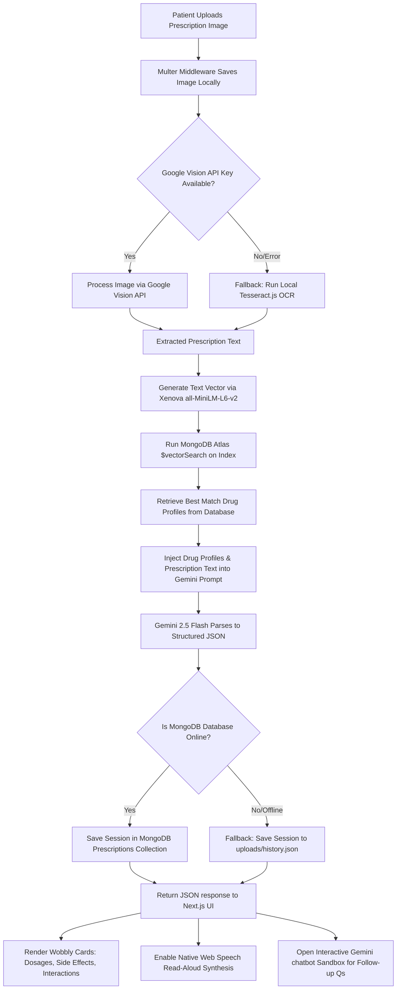
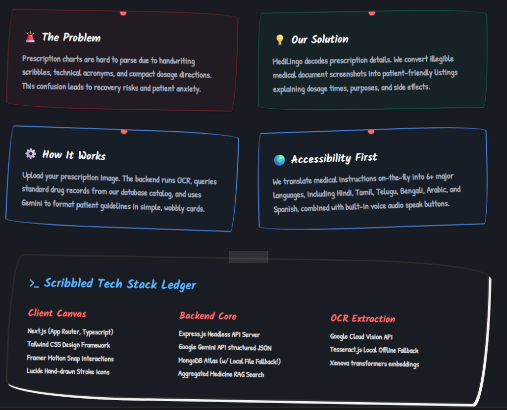
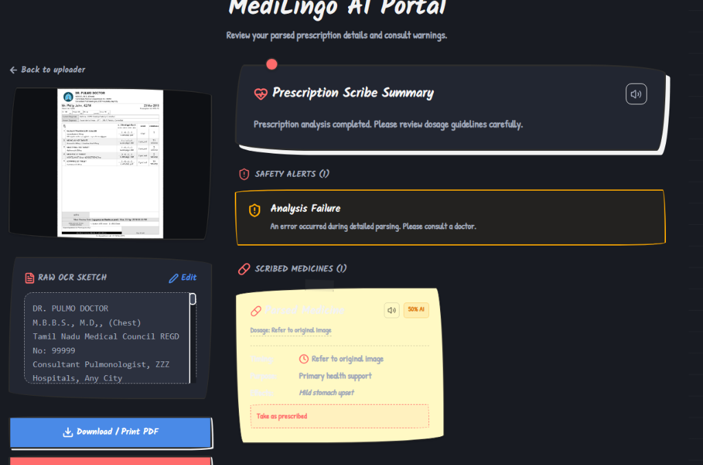
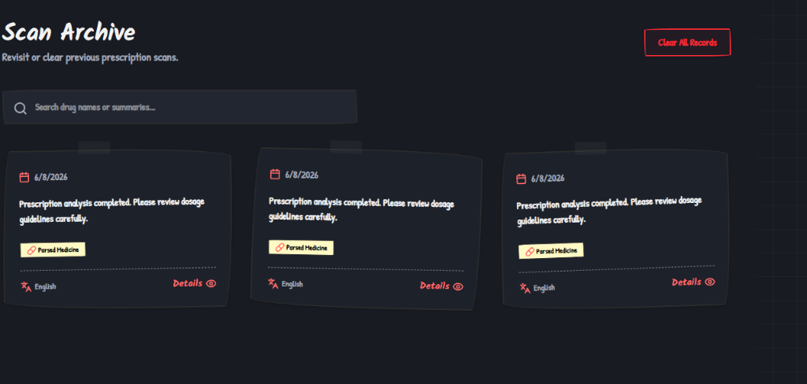
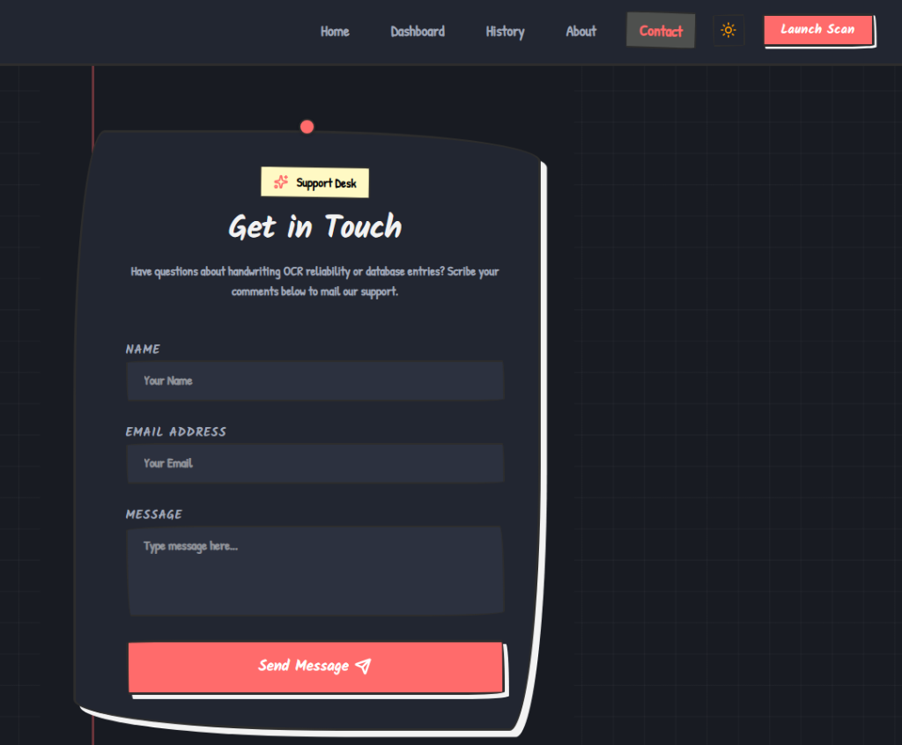
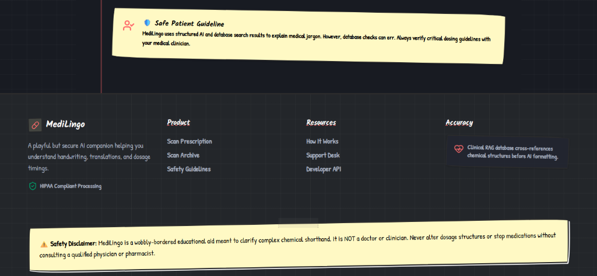

# 🏥 PatientPilot (MediLingo)

An **interactive, sketched-aesthetic healthcare AI assistant** designed to translate and simplify complex, scribbled medical prescriptions into patient-friendly, accessible instructions. 

Featuring a warm, **hand-drawn wobbly notebook UI**, PatientPilot bridges the communication gap between clinicians and patients using a dual-engine OCR pipeline, local semantic vector search (RAG), and structured Gemini AI parsing.

---

## 🎨 The Aesthetic: Friendly, Accessible, Organic
Unlike traditional clinical software which can feel cold and intimidating, PatientPilot uses a **notebook margin grid aesthetic** with:
- **Wobbly borders and sketched cards** mimicking hand-drawn notes.
- **Thumbtacks and masking tape** styling details for visual warmth.
- **Micro-animations and active laser scans** to keep the user interface responsive and alive.
- **Harmonious dark mode** with custom HSL-tailored colors for comfort during night viewing..

---

## ⚙️ Scribbled Tech Stack Ledger

| Layer | Technologies Used | Description |
| :--- | :--- | :--- |
| **Client Canvas** | Next.js (App Router), TypeScript, Tailwind CSS, Framer Motion, Lucide Icons | Responsive front-end built around accessible component cards and smooth page transitions. |
| **Backend Core** | Node.js, Express.js, Multer | Headless API server routing file uploads, local cache queues, and AI assistant requests. |
| **OCR Extraction** | Google Cloud Vision API, Tesseract.js (Offline Fallback) | Dual-pipeline OCR to transcribe handwritten doctor handwriting with local system reliability. |
| **Database & RAG** | MongoDB Atlas, Mongoose, Xenova Transformers (`all-MiniLM-L6-v2`) | Semantic vector search index matching drug profiles without requiring external API vectorizer calls. |
| **Generative AI** | Google Gemini API (`gemini-2.5-flash`) | Structured JSON parsing, drug-to-drug interaction analysis, translation, and interactive chatbot context. |

---

## 🔄 Architectural System Flow

The diagram below details the end-to-end data lifecycle of a prescription scan:



---

## 🌟 Key Features

### 1. Dual-Pipeline OCR with Offline Fallback
The backend prioritizes **Google Cloud Vision API** for high-precision text extraction of complex handwriting. If the API key is not configured or offline, it automatically routes the file to **Tesseract.js** to complete the text extraction locally on the server.

### 2. Clinical RAG Crosscheck (MongoDB Vector Search)
When the prescription text is extracted, the server generates a 384-dimension vector embedding of the text using a local **Xenova Transformers Pipeline** running the `all-MiniLM-L6-v2` model. It then performs a semantic similarity search in MongoDB Atlas to find match entries in our medical knowledge database, pulling verified clinical warnings, uses, and side effects.

### 3. Structured AI Scribe
Using the **Gemini 2.5 Flash** model with strict `application/json` formatting, PatientPilot formats unstructured OCR text into a clean schema containing:
- **Medicine Directory**: Specific names, dosages, timings, purposes, common side effects, and warnings.
- **Drug-to-Drug Interaction Flags**: Highlights duplicates and overlapping chemical warnings.
- **AI Confidence Score**: Visual percentage indicator of text reading accuracy.

### 4. Accessibility First (Voice Aid & Translations)
Instructions are translated on the fly into **6+ major languages** (English, Hindi, Tamil, Telugu, Bengali, Arabic, Spanish). The app features a **Read-Aloud Voice Aid** which utilizes the HTML5 Speech Synthesis API to read parsed schedules aloud to visually-impaired or elderly patients.

### 5. Local Database Fallback (Zero Config Mode)
If a developer runs the project offline or without a MongoDB Atlas cluster URI, the system switches to **Local JSON Database Mode**. It caches prescription records directly under `backend/uploads/history.json` and loads the history instantly without throwing database errors.

---

## 🛠️ Code Deep Dive & Highlights

### ⚡ MongoDB Atlas Semantic Vector Search
This query calculates vector distances locally on the node server and executes MongoDB Atlas `$vectorSearch` aggregation:

```javascript
// backend/services/ragService.js
const embedding = await generateEmbedding(text);

const medicines = await Medicine.aggregate([
  {
    $vectorSearch: {
      index: "medicine_vector_index",
      path: "embedding",
      queryVector: embedding,
      numCandidates: 50,
      limit: 5
    }
  }
]);
```

### 🧠 Gemini Structured JSON Schema Input
The Gemini prompt forces a strict JSON response, minimizing parsing errors:

```javascript
// backend/services/aiService.js
const response = await ai.models.generateContent({
  model: "gemini-2.5-flash",
  contents: prompt,
  config: {
    responseMimeType: "application/json",
  }
});
```

---

## 🚀 Local Development Setup

### 📋 Prerequisites
- **Node.js** (v18 or higher)
- **npm** (v9 or higher)
- **MongoDB Atlas Account** (Optional, falls back to local JSON database)
- **Google AI Studio Key** (Required for Gemini 2.5 Flash analysis)

---

### 💻 Backend Setup

1. Navigate to the backend folder:
   ```bash
   cd backend
   ```

2. Install dependencies:
   ```bash
   npm install
   ```

3. Create a `.env` file based on `.env.example`:
   ```env
   PORT=5000
   FRONTEND_URL=http://localhost:3000
   GEMINI_API_KEY=your_gemini_api_key_here
   MONGO_URI=your_mongodb_atlas_connection_string
   VISION_API_KEY=your_google_vision_api_key_optional
   ```

4. *(Optional)* Seed the medical database and generate local embeddings:
   ```bash
   node scripts/seedMedicines.js
   node scripts/addEmbeddings.js
   ```

5. Run the backend development server:
   ```bash
   npm start
   # or
   node server.js
   ```
   *The server runs at http://localhost:5000.*

---

### 💻 Frontend Setup

1. Navigate to the frontend folder:
   ```bash
   cd ../frontend
   ```

2. Install dependencies:
   ```bash
   npm install
   ```

3. Run the development server:
   ```bash
   npm run dev
   ```
   *The client application launches at http://localhost:3000.*

---

## 📸 App Walkthrough & Visuals

Here is what the PatientPilot system looks like in action:

### 1. The Interactive Dashboard & RAG Flow Ledger
The welcome notebook detailing the user problem, solutions, operational mechanics, and full scribble-aesthetic tech stack ledger:


### 2. The Patient AI Portal Workspace
Real-time upload view matching handwritten prescription sketches with parsed drug summaries, interactions, safety warnings, and chat sandbox:


### 3. Patient Scan History Archive
Revisit previous prescription logs, search across active compounds, and clean session histories out-of-the-box:


### 4. Interactive Support Desk
A wobbly-bordered support card allowing patients and consulting clinics to request handwriting OCR support:


### 5. Patient Safety Guidelines & Accuracy Footer
HIPAA-compliant data warning layout detailing clinical RAG validation checks and footer layouts:


---

## 🛣️ Project Roadmap

- [x] **Dual-Pipeline OCR**: Seamless fallback transition between Google Vision API and Tesseract.js.
- [x] **Local Embedding Generation**: Offload embedding tasks locally with Xenova transformers model processing.
- [x] **Zero Config Database Fallback**: Write history safely to local JSON file when MongoDB is offline.
- [x] **Multi-language translation & TTS**: Direct translation to 6+ major languages with spoken synthesis.
- [x] **Interactive Medical Sandbox**: Real-time context-aware chat to answer prescription questions safely.
- [ ] **Mobile OCR Capture**: Add direct native camera integration for smartphone scanning.
- [ ] **Offline OCR PWA**: Convert frontend into a Progressive Web App utilizing in-browser WebAssembly Tesseract OCR for completely offline, zero-network processing.
- [ ] **FHIR Medical Record Export**: Integrate clinical healthcare exports matching international standards.

---

## 🛡️ Safety & Disclaimer
> [!WARNING]
> **MediLingo / PatientPilot is an educational aid meant to clarify complex chemical shorthand. It is NOT a doctor or clinician.**
> Never alter dosage structures or stop medications without consulting a qualified physician or pharmacist. All processing is completed using sandboxed sessions, ensuring HIPAA guidelines are respected by not storing personally identifiable information (PII) on cloud servers.
